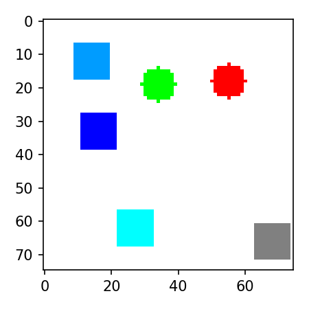
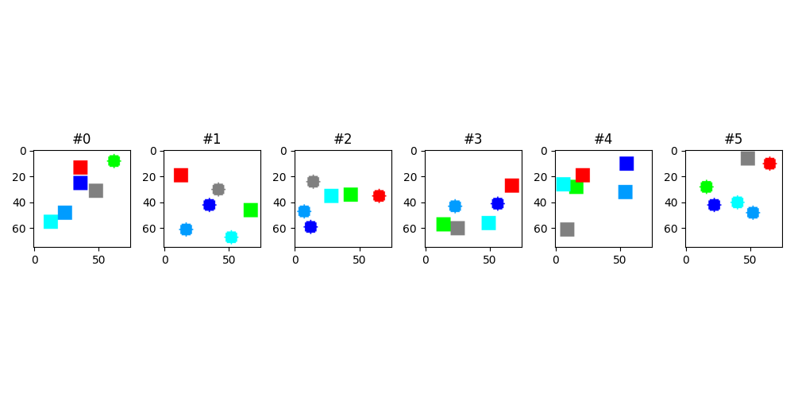
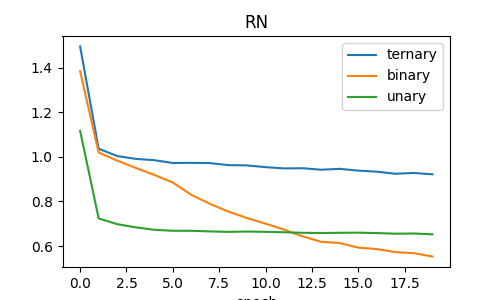
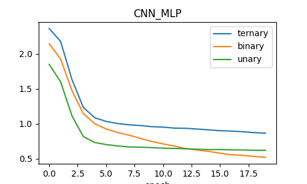

# Relational netwlrk 

### Sort-of-clever dataset




### Training example

#### RN
```
Model: RN

 Test set: Ternary accuracy: 53% Binary accuracy: 60% | Unary accuracy: 54%
```


#### CNN_MLP
```
Model: CNN_MLP

 Test set: Ternary accuracy: 45% Binary accuracy: 39% | Unary accuracy: 46%
```
